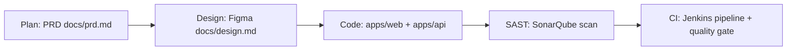

# SDLC Overview — Wings Dashboard Platform

This repository is a working demonstration of an end-to-end Software Development Life Cycle (SDLC).
Each phase below maps to a concrete artifact in this repo and a tool in the delivery toolchain.

## Phase → Tool → Artifact

| Phase | Tool | Artifact in this repo |
| --- | --- | --- |
| 1. Plan | PRD (Product Requirements Document) | [docs/prd.md](prd.md) |
| 2. Design | Figma | [docs/design.md](design.md) (link + tokens) |
| 3. Develop | Next.js (frontend) + NestJS (backend) | [apps/web](../apps/web), [apps/api](../apps/api) |
| 4. Analyze (SAST) | SonarQube | [sonar-project.properties](../sonar-project.properties) |
| 5. Build & Verify (CI) | Jenkins | [Jenkinsfile](../Jenkinsfile) |

## Flow

## How the phases connect

1. **Plan** — The PRD defines the problem, goals, user stories, and acceptance criteria.
   Every feature in the codebase traces back to a user story ID (e.g. `US-1 Login`).
2. **Design** — Figma is the single source of truth for layout and visual style.
   Screens in `apps/web` are implemented 1:1 from the Figma frames; design tokens
   (colors, spacing, typography) are recorded in [docs/design.md](design.md).
3. **Develop** — Monorepo with two workspaces:
   - `apps/web` — Next.js (App Router) frontend: login, dashboard, logout.
   - `apps/api` — NestJS backend: JWT auth + dashboard summary API.
4. **Analyze** — Every change is scanned by SonarQube (static application security
   testing + code quality). Configuration lives in `sonar-project.properties`.
5. **Build & Verify** — Jenkins runs the declarative pipeline in `Jenkinsfile`:
   install → lint → test → build → SonarQube analysis → quality gate. A failed
   quality gate blocks the pipeline, enforcing the "quality built in" principle.

## Demo credentials

| Field | Value |
| --- | --- |
| Email | `admin@wings.io` |
| Password | `Demo123!` |

> Credentials are read from environment variables (see `apps/api/.env.example`) —
> never hardcoded in source.
